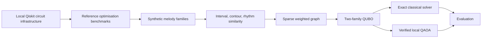

# Quantum Folk Lab

Quantum computing is difficult to learn because many demonstrations are abstract, opaque, and
disconnected from meaningful subject matter. Quantum Folk Lab turns folk-music-derived
optimisation problems into transparent, exact-first learning experiences in which users can
inspect the classical truth, compare quantum heuristics, and understand what real hardware did
and did not demonstrate.

The public product deliberately separates three evidence layers: a deterministic synthetic fixture
for guided teaching; a governed, licence- and provenance-gated real-data experiment programme;
and bounded IBM Quantum hardware results. Not every guided example uses raw historical notation,
and the application does not provide audio playback. Exact classical evaluation remains
authoritative throughout.

## Research Question

Given a small set of synthetic symbolic melodies and interpretable pairwise similarities, can a two-family QUBO formulation recover known tune families, and how do local QAOA-style samples compare with exact classical optima?



## Quick Start

PowerShell:

```powershell
py -m venv .venv
.\.venv\Scripts\Activate.ps1
python -m pip install -e ".[dev]"
qfl doctor
qfl compare --seed 42
```

Bash:

```bash
python -m venv .venv
source .venv/bin/activate
python -m pip install -e ".[dev]"
qfl doctor
qfl compare --seed 42
```

## OpenAI Build Week 2026 — judge quick start

Quantum Folk Lab is an Education product: learners reveal every answer to a small, interpretable
problem before comparing a bounded quantum heuristic or reading an explanation.

- **Before Build Week:** the public Foundations console and registered research experiments
  already existed at commit `281ba40`.
- **Built during Build Week:** the validated exact-first service and Guided Experiment were added
  after governing-plan commit `3950a1f`.

```powershell
python -m pip install -e ".[learning]"
streamlit run apps/learning_console/app.py
```

In the app, open **Experiments** (the default), follow **Guided Experiment**, and click
**Reveal all 256 assignments**. Then inspect **Foundations** and **Glossary**. The current app
shows exact synthetic-fixture evidence, registered local ideal-simulator evidence, and the compact
experiment story; it does not yet contain a dedicated EXP-010D/011 result panel.

The core app requires no IBM credential. Its deterministic explanation works without an OpenAI
API key. Optional GPT-5.6 explanation uses `.[ai]`, receives only governed evidence, and fails
closed to the deterministic explanation when unavailable or invalid. Optional local Qiskit uses
`.[quantum]` and is explicitly button-gated.

Public hardware reports:

- [EXP-010D result](experiments/EXP-010D-hardware-parameter-landscape-run/RESULT-REPORT.md)
- [EXP-011 result](experiments/EXP-011-dense-hardware-landscape-run/RESULT-REPORT.md)

See the [Build Week judging guide](docs/build-week/JUDGING-GUIDE.md) for the shortest review path.

### Hardware-era result summary

**EXP-010D.** One `ibm_fez` job returned all 32 PUBs at 4,096 shots per PUB. The
ideal-versus-hardware landscape Spearman rho was `0.96`, producing the frozen classification
**LANDSCAPE SUPPORTED**. The centre ranked first, its most-likely state was `1010`, and the
predeclared control-quality warning was retained.

**EXP-011.** One separate `ibm_fez` job returned all 88 PUBs at 4,096 shots per PUB. Across the
full 81-cell landscape, rho was `0.9046747967479675`; the embedded original 25-cell rho was
`0.9315384615384615`; and EXP-010D/EXP-011 cross-run rho was `0.9776923076923076`, with repeated-
cell mean absolute R difference `0.01871101322274423`. The frozen classification was **STRONGLY
REPLICATED**. The centre ranked `4/81`, within the frozen top-five check, its most-likely state was
`1010`, and the control-quality warning was retained.

These results concern preservation and independent replication of a small parameter-landscape
structure. Exact classical evaluation remains authoritative. They do not demonstrate quantum
advantage, speedup, generalisation, musical truth, or commercial superiority.

### Built with Codex and GPT-5.6

Codex accelerated repository inspection, bounded implementation, tests, CI diagnosis, visual
review, experiment packaging, fail-closed hardware preparation, result regeneration, and PR
verification. Gwri retained and explicitly exercised product, scientific, hardware-authorization,
interpretation, and merge authority. GPT-5.6 remained an optional explanation layer; it did not
calculate experiments, choose hardware work, or determine claims.

GPT-5.6 optionally explains validated results at different learner levels; deterministic code
calculates the result. Its input is filtered, and output is schema-, grounding-, number-, and
claim-checked. It cannot alter registered values, and invalid or unavailable output fails closed to
the deterministic explanation. **The AI can explain the experiment. It cannot rewrite the
evidence.**

Evidence: [Codex contribution log](docs/build-week/CODEX-CONTRIBUTION-LOG.md),
[Codex and GPT-5.6 evidence](docs/build-week/CODEX-AND-GPT56-EVIDENCE.md),
[before and after](docs/build-week/BEFORE-AND-AFTER.md), and
[judging guide](docs/build-week/JUDGING-GUIDE.md).

## EXP-001: Local Qiskit Circuit Infrastructure

EXP-001 is complete and validates local Qiskit circuit construction, transpilation, measurement, and finite-shot reporting with Aer simulation only. It requires optional quantum dependencies but no IBM account, no token, and no QPU access.

```powershell
py -3.13 -m venv .venv-qiskit
.\.venv-qiskit\Scripts\Activate.ps1
python -m pip install --upgrade pip
python -m pip install -e ".[dev,quantum]"
qfl basics-list
qfl basics-run --experiment zero --shots 1024
qfl basics-run --experiment hadamard --shots 4096
qfl basics-run --experiment bell --shots 4096
```

The circuit-infrastructure commands fail clearly when Qiskit is not installed; they do not substitute classical pseudo-results.


## EXP-002: Max-Cut Reference

EXP-002 is complete and uses the four-node `cycle4` Max-Cut benchmark as a transparent reference problem. It compares exact enumeration, verified QUBO/Ising algebra, statevector expectation during QAOA parameter optimisation, and finite-shot sampling from a genuine local Qiskit circuit.

```powershell
qfl maxcut-list
qfl maxcut-exact --graph cycle4
qfl maxcut-qaoa --graph cycle4 --depth 1 --shots 4096
qfl maxcut-compare --graph cycle4 --depth 1 --shots 4096
```

The exact maximum cut is `4.0` with complementary optima `0101` and `1010`. The registered p=1 QAOA run samples an optimal bitstring, but its expected approximation ratio is about `0.75`; this distinction is deliberate. Brute force is superior for this tiny instance, and no quantum advantage is claimed.

## Experiments

| Experiment | Status | Purpose |
| --- | --- | --- |
| EXP-001 quantum basics | complete | local Qiskit circuit and measurement infrastructure |
| EXP-002 Max-Cut reference | complete | exact Max-Cut, verified QUBO/Ising mapping, and genuine local Qiskit QAOA |
| EXP-003 synthetic tune families | complete | deterministic labelled benchmark |
| EXP-004 QUBO family partition | complete | transparent two-family binary model |
| EXP-005A tune-family QAOA | complete | verified tune-family QUBO/Ising mapping and genuine local Qiskit p=1 QAOA |
| EXP-006 noise sensitivity | planned | local noise-model comparison |
| EXP-007A IBM smoke test | complete | one-job connectivity evidence with disclosed 256-shot deviation |
| EXP-008–009 real-data gates | complete | licence/provenance selection and rejection of weak formulations |
| EXP-010A–C compact hardware study | complete | exact compact encoding, fail-closed preparation, and controlled validation |
| EXP-010D landscape | complete | 25-cell IBM parameter-landscape support with retained warning |
| EXP-011 dense replication | complete | independent 81-cell IBM landscape replication with retained warning |

## Core Commands

```bash
qfl generate-synthetic --seed 42
qfl solve-exact --seed 42
qfl solve-qaoa --seed 42
qfl compare --seed 42
python scripts/check_public_safety.py
```

The existing `solve-qaoa` path is a deterministic classical fallback over QUBO energies and should not be interpreted as genuine Qiskit QAOA. EXP-005A adds separate `tune-family-*` commands for exact verification and genuine local Qiskit QAOA execution.

## Research Discipline

- Exact classical enumeration remains the ground truth for registered small fixtures.
- All basis states are checked for small benchmark instances before QAOA claims are interpreted.
- Expected energy and best sampled solution are reported separately.
- Classical fallback sampling must never be presented as genuine QAOA.
- Plans and implementations receive separate review before results are published.

## Responsible Scope

Music is used here as an interpretable sequence testbed. The repository does not imply that quantum computing automatically discovers deeper cultural patterns or currently outperforms classical methods. Future public-data work must pass licence, provenance, privacy, and cultural-context review before ingestion.

## Limitations

The learning fixture and exact 256 Reveal are deliberately small. Local ideal simulation does not
represent hardware noise, topology, drift, or readout error. The two governed IBM landscape jobs
provide bounded evidence for one frozen four-qubit structure, not general usefulness. Hardware
access remains absent from the app and disabled from ordinary test and documentation paths.

## Licence

MIT.
