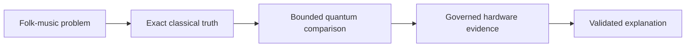

# Quantum Folk Lab

> See the exact answer first, then discover what simulation, real quantum hardware and AI
> explanation add.

Quantum computers are often introduced through impressive-looking charts without giving a
beginner a simple way to know whether the answer is right. Quantum Folk Lab changes that order.

Quantum Folk Lab is a hands-on learning console that uses small folk-music puzzles to show what
quantum computing can—and cannot—do. You make a prediction, reveal every possible answer, compare
a quantum simulation, and then inspect evidence recorded from a real IBM quantum computer. The
known classical answer always comes first, so the learner never has to take the quantum result on
trust.

Inside the app, GPT-5.6 can explain the validated result at the level you choose. It receives
governed evidence and may explain that evidence, but it cannot calculate the answer or change the
result. You can also download the governed learning record and use it as evidence when continuing
the discussion in ChatGPT or Codex.

No knowledge of quantum computing, artificial intelligence or music theory is required.

## Why folk tunes?

Folk tunes contain repetition, variation and family resemblance. Those familiar ideas can be
turned into small grouping puzzles whose complete set of possible answers is still easy for a
computer to check.

That makes folk music a useful teaching case: the learner can understand the question before
meeting the mathematics. The project does not claim that a quantum computer understands music,
discovers cultural truth or outperforms ordinary computers.

## What will I learn?

By completing the guided journey, you should be able to explain:

- why a known classical answer is needed before judging a quantum result;
- the difference between an exact calculation, an ideal simulation and evidence from real hardware;
- why repeated measurements, controls and noise matter;
- how an AI explanation can help a learner without becoming the source of truth;
- why a small successful experiment is not evidence of quantum advantage or general scalability.

## Who is it for?

Quantum Folk Lab is intended for:

- first-time quantum-computing learners;
- teachers looking for a transparent classroom demonstration;
- technically curious musicians;
- developers and researchers who want to inspect the complete evidence and code.

## The learning journey

1. **Make a prediction.** Look at eight small, invented tune variants and predict how they belong
   together.
2. **Reveal every answer.** The app checks all 256 possible groupings and shows the best answers.
3. **Compare a quantum simulation.** See how a bounded quantum method behaves when the exact result
   is already known.
4. **Move to real folk-data evidence.** Inspect a compact problem derived from governed
   public-source research.
5. **Inspect real hardware.** Compare the exact reference with sanitised results already recorded
   from IBM quantum hardware.
6. **Ask for an explanation.** Choose a learner level and optionally ask GPT-5.6 to explain the
   validated evidence.
7. **Keep the record.** Download the governed result for inspection or further discussion in
   ChatGPT or Codex.

The synthetic teaching example is deliberately small. Checking all 256 answers is simpler and
more authoritative than using a quantum method. That is a feature of the lesson, not a limitation
to hide.

## Try it in a few minutes

### What you need

- Python 3.11 or later;
- a desktop terminal or PowerShell;
- internet access for the initial package installation.

You do not need:

- an IBM Quantum account;
- an IBM credential;
- an OpenAI API key;
- Qiskit;
- a separate folk-music dataset.

The complete core learning journey works without credentials or cloud services.

Check your Python version with `python --version` (or `py --version` on Windows). It must report
Python 3.11 or later.

### Get the repository

If you do not use Git, open the repository on GitHub, select **Code → Download ZIP**, extract the
download, and open a terminal in the extracted `quantum-folk-lab` folder.

With Git:

```bash
git clone https://github.com/GwriPennar/quantum-folk-lab.git
cd quantum-folk-lab
```

### Windows PowerShell

```powershell
py -m venv .venv
.\.venv\Scripts\Activate.ps1
python -m pip install --upgrade pip
python -m pip install -e ".[learning]"
python -m streamlit run apps/learning_console/app.py
```

### macOS or Linux

```bash
python3 -m venv .venv
source .venv/bin/activate
python -m pip install --upgrade pip
python -m pip install -e ".[learning]"
python -m streamlit run apps/learning_console/app.py
```

### What success looks like

Your browser should open the Quantum Folk Lab Learning Console. Select **Experiments**, begin with
**Start here · Guided experiment**, make a prediction, and press **Reveal all 256 answers**.

Then visit **Real folk data & IBM results** to follow the same exact-first method using committed
real-data and hardware evidence. Use **Foundations** when you want the concepts explained from the
beginning and **Glossary** when you meet an unfamiliar term.

If the browser does not open automatically, copy the local address shown by Streamlit into the
browser.

## What data is included?

The main experience is self-contained:

- The Guided Experiment uses eight deterministic, invented tune variants. It does not contain
  private or copyrighted source tunes.
- The real-data section uses governed, non-reconstructable aggregate evidence from licence- and
  provenance-reviewed public-source research. Raw source melodies are not redistributed.
- The hardware section reads sanitised, committed IBM experiment results. It does not contact IBM
  or submit a new job.
- The deterministic explanations, Foundations lessons and Glossary are included in the repository.
- No additional data download is required for the main Learning Console.

## Four layers of evidence

| Layer | Question it answers | Authority |
|---|---|---|
| Exact calculation | What is the best answer when every possibility is checked? | The reference truth for these small problems |
| Ideal quantum simulation | What does the bounded quantum method do without hardware noise? | A comparison, not the source of truth |
| Recorded IBM hardware | What happened on a real quantum computer? | Governed experimental evidence with limitations |
| GPT-5.6 explanation | How can the validated result be explained for this learner? | An explanation only; it cannot change the evidence |

The detailed evidence uses four technical terms:

- **shots:** repeated measurements of a quantum circuit;
- **PUBs:** packaged circuit-and-parameter experiments sent together;
- **R:** a normalised performance score used in the registered hardware study;
- **rho:** a rank-correlation measure showing whether two result landscapes have a similar ordering.

Only now do the governed experiment identifiers and registered values appear:

- **EXP-010C — first hardware validation:** the exact optimum `1010` remained the most likely state.
- **EXP-010D — controlled 25-cell landscape:** ideal/hardware rho `0.96`, classified
  **LANDSCAPE SUPPORTED**.
- **EXP-011 — independent 81-cell replication:** full rho `0.9047`, embedded-25 rho `0.9315`, and
  cross-run rho `0.9777`, classified **STRONGLY REPLICATED**.

Both landscape reports retain the predeclared control warning. Read the authoritative
[EXP-010D report](experiments/EXP-010D-hardware-parameter-landscape-run/RESULT-REPORT.md) and
[EXP-011 report](experiments/EXP-011-dense-hardware-landscape-run/RESULT-REPORT.md).

## Built with Codex and GPT-5.6

Quantum Folk Lab existed before Build Week as a reproducible quantum-optimisation research
repository. During Build Week, Codex helped turn that research into a coherent educational product.

Codex accelerated:

- implementation of the public Streamlit Learning Console;
- the prediction-and-Reveal learner interaction;
- Foundations and Glossary integration;
- exact, simulation and hardware evidence presentation;
- schema validation and fail-closed GPT-5.6 integration;
- automated tests, release checks, CI diagnosis and visual review;
- preparation of reproducibility and submission documentation.

Gwri retained the important human decisions: the educational direction, scientific questions,
source selection, licence and cultural-context gates, hardware authorisation, experiment stopping
rules, interpretation, claims and merge decisions.

GPT-5.6 has a narrower runtime role. It may rewrite a validated result for **First encounter**,
**Technical learner** or **Research detail**. It receives filtered evidence and its output is
checked for schema, grounding, unsupported numbers and prohibited claims. If the model is
unavailable or its response fails validation, the application displays the complete deterministic
explanation instead.

**Codex helped build and verify the product. GPT-5.6 may explain the evidence. Neither replaces the
exact result or human scientific judgement.**

Read [Before and after](docs/build-week/BEFORE-AND-AFTER.md), the
[Codex contribution log](docs/build-week/CODEX-CONTRIBUTION-LOG.md), and the
[Codex and GPT-5.6 evidence](docs/build-week/CODEX-AND-GPT56-EVIDENCE.md).

## Optional features

These are not part of the minimum judge path.

### Optional local Qiskit comparison

```bash
python -m pip install -e ".[learning,quantum]"
python -m streamlit run apps/learning_console/app.py
```

This enables a local ideal simulation only. It makes no IBM call and remains button-gated.

### Optional GPT-5.6 explanation

```bash
python -m pip install -e ".[learning,ai]"
```

Configure the standard OpenAI SDK credential only in the current shell, using your own value in
place of the placeholder.

Windows PowerShell:

```powershell
$env:OPENAI_API_KEY = "<your-openai-api-key>"
```

macOS or Linux:

```bash
export OPENAI_API_KEY="<your-openai-api-key>"
```

Never commit a credential or put a real value into README examples, screenshots, test fixtures or
logs. The application remains complete without one. An optional request occurs only when the user
presses the GPT-5.6 explanation button; otherwise the deterministic explanation is used.

## Reproduce and test the release

The Learning Console displays committed evidence, but the repository also includes tests and
release checks so that a technical reviewer can verify the application independently.

```bash
python -m pip install -e ".[dev,learning]"
python -m pytest -m "not quantum"
python scripts/check_public_safety.py
python scripts/verify_build_week_release.py
python -m streamlit run apps/learning_console/app.py
```

- `pytest` runs the credential-free non-quantum regression suite.
- `check_public_safety.py` rejects private paths, secret-like values and unapproved binary files.
- `verify_build_week_release.py` checks the public documents, schema and deterministic example.
- `streamlit` starts the same local Learning Console used in the learner journey.

For the optional complete local-Qiskit route:

```bash
python -m pip install -e ".[dev,learning,quantum]"
python -m pytest
```

This amendment was verified on Microsoft Windows (`10.0.26200`, x64): Python 3.11.9 completed the
clean credential-free core install and launch, and Python 3.13.5 completed the full optional-Qiskit
test suite.

## Honest limits

Quantum Folk Lab is a transparent educational demonstrator built from deliberately small
experiments.

It does not demonstrate:

- quantum advantage or speedup;
- scalability to large music collections;
- general tune-family discovery;
- musical quality or cultural truth;
- commercial superiority;
- live IBM execution from the public application;
- audio playback or music generation;
- proven classroom effectiveness.

Exact classical evaluation remains authoritative. The committed hardware results show what
happened in small, controlled studies. A future evaluation with learners and educators would be
needed before claiming measured educational impact.

## Repository map

| Location | Purpose |
|---|---|
| `apps/learning_console/` | Public Streamlit learning experience |
| `src/quantum_folk_lab/` | Deterministic models, validation, exports and optional integrations |
| `learn/` | Portable Foundations lessons and Glossary |
| `experiments/` | Governed experiment plans, artefacts and reports |
| `examples/build-week/` | Example reproducibility record |
| `docs/build-week/` | Judging guide, contribution evidence, limitations and submission materials |
| `tests/` | Scientific, application, safety and release regression tests |

## Deeper research documentation

Start with the [Build Week judging guide](docs/build-week/JUDGING-GUIDE.md). Detailed experiments
and developer commands continue below.

### Research question

Given a small set of synthetic symbolic melodies and interpretable pairwise similarities, can a
two-family QUBO formulation recover known tune families, and how do local QAOA-style samples
compare with exact classical optima?



### Developer quick start

```bash
python -m venv .venv
source .venv/bin/activate
python -m pip install -e ".[dev]"
qfl doctor
qfl compare --seed 42
```

## EXP-001: Local Qiskit Circuit Infrastructure

EXP-001 is complete and validates local Qiskit circuit construction, transpilation, measurement, and finite-shot reporting with Aer simulation only. It requires optional quantum dependencies but no IBM account, no token, and no QPU access.

```powershell
py -3.13 -m venv .venv-qiskit
.\.venv-qiskit\Scripts\Activate.ps1
python -m pip install --upgrade pip
python -m pip install -e ".[dev,quantum]"
qfl basics-list
qfl basics-run --experiment zero --shots 1024
qfl basics-run --experiment hadamard --shots 4096
qfl basics-run --experiment bell --shots 4096
```

The circuit-infrastructure commands fail clearly when Qiskit is not installed; they do not substitute classical pseudo-results.


## EXP-002: Max-Cut Reference

EXP-002 is complete and uses the four-node `cycle4` Max-Cut benchmark as a transparent reference problem. It compares exact enumeration, verified QUBO/Ising algebra, statevector expectation during QAOA parameter optimisation, and finite-shot sampling from a genuine local Qiskit circuit.

```powershell
qfl maxcut-list
qfl maxcut-exact --graph cycle4
qfl maxcut-qaoa --graph cycle4 --depth 1 --shots 4096
qfl maxcut-compare --graph cycle4 --depth 1 --shots 4096
```

The exact maximum cut is `4.0` with complementary optima `0101` and `1010`. The registered p=1 QAOA run samples an optimal bitstring, but its expected approximation ratio is about `0.75`; this distinction is deliberate. Brute force is superior for this tiny instance, and no quantum advantage is claimed.

## Experiments

| Experiment | Status | Purpose |
| --- | --- | --- |
| EXP-001 quantum basics | complete | local Qiskit circuit and measurement infrastructure |
| EXP-002 Max-Cut reference | complete | exact Max-Cut, verified QUBO/Ising mapping, and genuine local Qiskit QAOA |
| EXP-003 synthetic tune families | complete | deterministic labelled benchmark |
| EXP-004 QUBO family partition | complete | transparent two-family binary model |
| EXP-005A tune-family QAOA | complete | verified tune-family QUBO/Ising mapping and genuine local Qiskit p=1 QAOA |
| EXP-006 noise sensitivity | planned | local noise-model comparison |
| EXP-007A IBM smoke test | complete | one-job connectivity evidence with disclosed 256-shot deviation |
| EXP-008–009 real-data gates | complete | licence/provenance selection and rejection of weak formulations |
| EXP-010A–C compact hardware study | complete | exact compact encoding, fail-closed preparation, and controlled validation |
| EXP-010D landscape | complete | 25-cell IBM parameter-landscape support with retained warning |
| EXP-011 dense replication | complete | independent 81-cell IBM landscape replication with retained warning |

## Core Commands

```bash
qfl generate-synthetic --seed 42
qfl solve-exact --seed 42
qfl solve-qaoa --seed 42
qfl compare --seed 42
python scripts/check_public_safety.py
```

The existing `solve-qaoa` path is a deterministic classical fallback over QUBO energies and should not be interpreted as genuine Qiskit QAOA. EXP-005A adds separate `tune-family-*` commands for exact verification and genuine local Qiskit QAOA execution.

## Research Discipline

- Exact classical enumeration remains the ground truth for registered small fixtures.
- All basis states are checked for small benchmark instances before QAOA claims are interpreted.
- Expected energy and best sampled solution are reported separately.
- Classical fallback sampling must never be presented as genuine QAOA.
- Plans and implementations receive separate review before results are published.

## Responsible Scope

Music is used here as an interpretable sequence testbed. The repository does not imply that quantum computing automatically discovers deeper cultural patterns or currently outperforms classical methods. Future public-data work must pass licence, provenance, privacy, and cultural-context review before ingestion.

## Limitations

The learning fixture and exact 256 Reveal are deliberately small. Local ideal simulation does not
represent hardware noise, topology, drift, or readout error. The two governed IBM landscape jobs
provide bounded evidence for one frozen four-qubit structure, not general usefulness. Hardware
access remains absent from the app and disabled from ordinary test and documentation paths.

## Licence

MIT.
