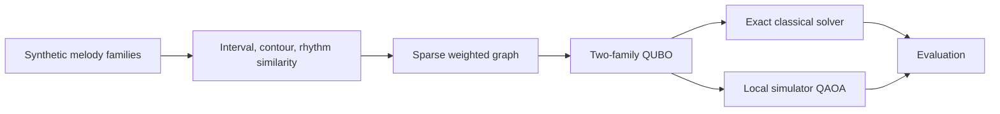

# Quantum Folk Lab

Quantum Folk Lab explores small, transparent optimisation problems inspired by symbolic music sequences. Classical methods create and evaluate the problem; QUBO, Ising and QAOA methods are then tested against exact classical baselines.

This is a learning and research repository, not a claim of quantum advantage. The first benchmark uses only deterministic synthetic melodies: no private corpora, no real tune collections, and no credentials are included.

## Research Question

Given a small set of synthetic symbolic melodies and interpretable pairwise similarities, can a two-family QUBO formulation recover known tune families, and how do local QAOA-style samples compare with exact classical optima?



## Quick Start

PowerShell:

```powershell
py -m venv .venv
.\.venv\Scripts\Activate.ps1
python -m pip install -e ".[dev]"
qfl doctor
qfl compare --seed 42
```

Bash:

```bash
python -m venv .venv
source .venv/bin/activate
python -m pip install -e ".[dev]"
qfl doctor
qfl compare --seed 42
```

Optional quantum dependencies can be installed with `python -m pip install -e ".[quantum]"`. IBM Quantum hardware support is deliberately optional and disabled by default.

## Experiments

| Experiment | Status | Purpose |
| --- | --- | --- |
| EXP-001 quantum basics | planned | one-qubit and Bell-state learning circuits |
| EXP-002 Max-Cut reference | planned | platform validation against brute force |
| EXP-003 synthetic tune families | complete | deterministic labelled benchmark |
| EXP-004 QUBO family partition | complete | transparent two-family binary model |
| EXP-005 QAOA simulator | complete | local simulator only, compared with exact optimum |
| EXP-006 noise sensitivity | planned | local noise-model comparison |
| EXP-007 IBM hardware | optional | dry-run first, explicit QPU confirmation required |

## Core Commands

```bash
qfl generate-synthetic --seed 42
qfl solve-exact --seed 42
qfl solve-qaoa --seed 42 --depth 1
qfl compare --seed 42
python scripts/check_public_safety.py
```

## Responsible Scope

Music is used here as an interpretable sequence testbed. The repository does not imply that quantum computing automatically discovers deeper cultural patterns or currently outperforms classical methods. Future public-data work must pass licence, provenance, privacy, and cultural-context review before ingestion.

## Limitations

The initial QAOA runner is a tiny local simulator path for bounded toy problems. If Qiskit is not installed, the package still demonstrates the optimisation workflow using the same QUBO and deterministic pseudo-sampling. Real hardware execution is not implemented as a default path and no QPU jobs are submitted.

## Licence

MIT.
