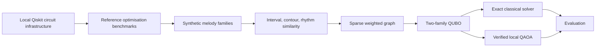

# Quantum Folk Lab

Quantum Folk Lab is a reproducible research repository investigating QUBO, Ising and QAOA formulations for tune-family inference and related computational-musicology optimisation problems.

The repository develops controlled synthetic benchmarks, exact classical validation, QUBO-to-Ising verification, and local Qiskit QAOA reference experiments. It makes no claim of quantum advantage, production readiness, or real-corpus tune-family discovery. Current tune-family work uses only deterministic synthetic melodies: no private corpora, no real tune collections, and no credentials are included.

## Research Question

Given a small set of synthetic symbolic melodies and interpretable pairwise similarities, can a two-family QUBO formulation recover known tune families, and how do local QAOA-style samples compare with exact classical optima?



## Quick Start

PowerShell:

```powershell
py -m venv .venv
.\.venv\Scripts\Activate.ps1
python -m pip install -e ".[dev]"
qfl doctor
qfl compare --seed 42
```

Bash:

```bash
python -m venv .venv
source .venv/bin/activate
python -m pip install -e ".[dev]"
qfl doctor
qfl compare --seed 42
```

## EXP-001: Local Qiskit Circuit Infrastructure

EXP-001 is complete and validates local Qiskit circuit construction, transpilation, measurement, and finite-shot reporting with Aer simulation only. It requires optional quantum dependencies but no IBM account, no token, and no QPU access.

```powershell
py -3.13 -m venv .venv-qiskit
.\.venv-qiskit\Scripts\Activate.ps1
python -m pip install --upgrade pip
python -m pip install -e ".[dev,quantum]"
qfl basics-list
qfl basics-run --experiment zero --shots 1024
qfl basics-run --experiment hadamard --shots 4096
qfl basics-run --experiment bell --shots 4096
```

The circuit-infrastructure commands fail clearly when Qiskit is not installed; they do not substitute classical pseudo-results.


## EXP-002: Max-Cut Reference

EXP-002 is complete and uses the four-node `cycle4` Max-Cut benchmark as a transparent reference problem. It compares exact enumeration, verified QUBO/Ising algebra, statevector expectation during QAOA parameter optimisation, and finite-shot sampling from a genuine local Qiskit circuit.

```powershell
qfl maxcut-list
qfl maxcut-exact --graph cycle4
qfl maxcut-qaoa --graph cycle4 --depth 1 --shots 4096
qfl maxcut-compare --graph cycle4 --depth 1 --shots 4096
```

The exact maximum cut is `4.0` with complementary optima `0101` and `1010`. The registered p=1 QAOA run samples an optimal bitstring, but its expected approximation ratio is about `0.75`; this distinction is deliberate. Brute force is superior for this tiny instance, and no quantum advantage is claimed.

## Experiments

| Experiment | Status | Purpose |
| --- | --- | --- |
| EXP-001 quantum basics | complete | local Qiskit circuit and measurement infrastructure |
| EXP-002 Max-Cut reference | complete | exact Max-Cut, verified QUBO/Ising mapping, and genuine local Qiskit QAOA |
| EXP-003 synthetic tune families | complete | deterministic labelled benchmark |
| EXP-004 QUBO family partition | complete | transparent two-family binary model |
| EXP-005A tune-family QAOA | complete | verified tune-family QUBO/Ising mapping and genuine local Qiskit p=1 QAOA |
| EXP-006 noise sensitivity | planned | local noise-model comparison |
| EXP-007 IBM hardware | optional | dry-run first, explicit QPU confirmation required |

## Core Commands

```bash
qfl generate-synthetic --seed 42
qfl solve-exact --seed 42
qfl solve-qaoa --seed 42
qfl compare --seed 42
python scripts/check_public_safety.py
```

The existing `solve-qaoa` path is a deterministic classical fallback over QUBO energies and should not be interpreted as genuine Qiskit QAOA. EXP-005A adds separate `tune-family-*` commands for exact verification and genuine local Qiskit QAOA execution.

## Research Discipline

- Exact classical enumeration remains the ground truth for registered small fixtures.
- All basis states are checked for small benchmark instances before QAOA claims are interpreted.
- Expected energy and best sampled solution are reported separately.
- Classical fallback sampling must never be presented as genuine QAOA.
- Plans and implementations receive separate review before results are published.

## Responsible Scope

Music is used here as an interpretable sequence testbed. The repository does not imply that quantum computing automatically discovers deeper cultural patterns or currently outperforms classical methods. Future public-data work must pass licence, provenance, privacy, and cultural-context review before ingestion.

## Limitations

EXP-001 uses ideal local simulation. Ideal simulator results do not represent real hardware noise, queueing, topology, calibration drift, or readout error. IBM Quantum hardware support is deliberately optional and disabled by default.

## Licence

MIT.
