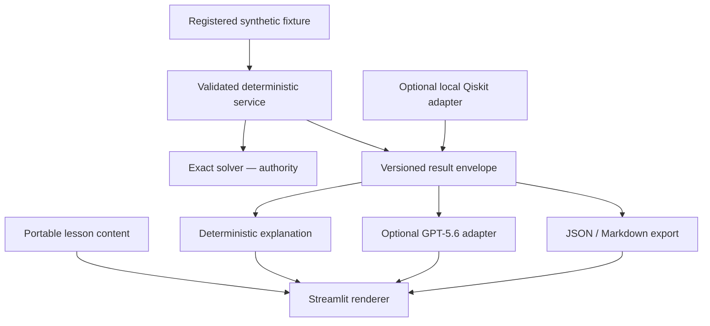

# Build Week implemented architecture

Scientific functions live under `src/quantum_folk_lab`; Streamlit only renders validated
contracts. The exact solver verifies direct/QUBO and QUBO/Ising agreement before issuing the
envelope. The Qiskit adapter calls the existing genuine route with a bounded fixed configuration.

## Trust boundaries

- The fixed public synthetic fixture is the only input; labels are evaluation-only.
- Exact enumeration of 256 assignments is authoritative.
- Current exact, current quick-Qiskit, and historical registered evidence have distinct labels.
- The optional AI adapter receives only a filtered envelope, learner level, task, and claim policy.
- AI output must pass strict schema, grounded-field, numeric, exact-result, and claim validation.
- Invalid or unavailable optional output falls back to deterministic text and is not persisted.
- No credentials, environment dump, arbitrary files, uploads, private paths, or hardware access
  cross into the product service.
