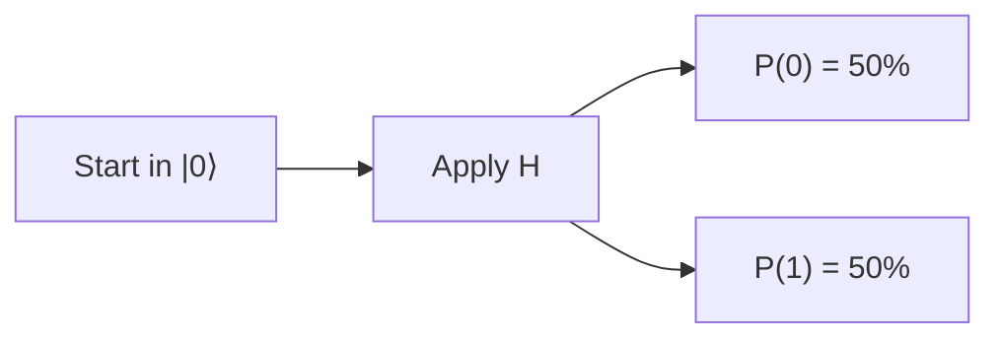

# Quantum Folk Lab Learning Console — Portable Content Architecture Spike

## Purpose

Re-architect the private Quantum Folk Lab Learning Console so that **Streamlit becomes one renderer of a portable learning system rather than the place where the learning system is defined**.

The current dual-mode app remains the working baseline:

- Guided Learner
- Researcher
- EXP-001, EXP-002 and EXP-005A
- local Qiskit execution
- read-only registered artefacts
- progress persistence
- visual components

This task is **not** a full rewrite and **not** an immediate migration away from Streamlit.

It is a controlled architecture spike designed to answer:

> Can the learning content, diagrams, scientific caveats, navigation metadata and review-pack semantics be defined independently of Streamlit, while Streamlit continues to provide the current local interactive experience?

The spike must produce working code, a limited migrated pilot, static export, tests and an evidence-based architecture evaluation. Do not migrate every lesson before the architecture has been evaluated.

---

# Architectural principle

The governing principle is:

> **Streamlit renders the Quantum Folk learning model; Streamlit does not define the learning model.**

Target separation:

```text
Portable lesson sources
Markdown + YAML metadata + Mermaid + typed directives
                         |
                         v
                Content registry/model
                         |
          +--------------+--------------+
          |                             |
          v                             v
  Scientific/domain services      Interaction definitions
  registered results, Qiskit,     predict, run, compare,
  QUBO/Ising, provenance          reveal maths, graph grouping
          |                             |
          +--------------+--------------+
                         |
                         v
                  Renderer adapters
          +--------------+--------------+
          |              |              |
          v              v              v
      Streamlit       static export    future web UI
        now           Markdown/HTML      later
```

Content must not depend on `streamlit` imports.

Scientific/domain services must not depend on Streamlit session state or visual layout.

Renderer code may depend on Streamlit, but only through clear adapter boundaries.

---

# Existing repository context

Public repository:

`GwriPennar/quantum-folk-lab`

Local checkout:

`C:\Users\gwrip\Documents\Machine_Learning\CymruFfowcGen\quantum-folk-lab`

Private app:

`private/streamlit/`

Streamlit URL:

`http://localhost:8503`

The public README already uses Mermaid for the research flow from Qiskit infrastructure through synthetic melody families, QUBO, exact solving and QAOA. Use this as a style and portability reference, but do not copy public documentation blindly into beginner lessons.

---

# Critical boundaries

Before implementation, preserve the established local/public boundary.

Do not:

- stage, commit or publish anything under `private/`
- remove, reset, stash, stage, revert or overwrite the intentional unstaged `.gitignore` change adding `private/`
- modify registered EXP-005A values
- regenerate or retune EXP-005A
- modify public experiment code or public result artefacts as part of this architecture spike
- merge or modify PR #10, PR #11 or this documentation PR
- switch the dirty original checkout away from `main`
- create another repository clone or Git worktree
- expose secrets, credentials, environment variables or absolute local paths
- place PDFs, PNG review packs or other binary evaluation artefacts inside the public repository root
- stop, restart or use ports 8501 or 8502

Use only port 8503 for the private Learning Console.

Create a new timestamped local-only backup before editing.

Keep the existing Streamlit experience operational throughout the spike.

---

# Scope: architecture spike, not full migration

Migrate only a representative pilot set:

1. **Bits and qubits**
2. **Hadamard and interference**
3. **EXP-001 Guided circuit flow**
4. **EXP-005A Guided case study**
5. one **Researcher explanatory/provenance view** for EXP-005A

These pilots are deliberately chosen to test:

- plain Markdown teaching content
- Mermaid diagrams
- dedicated visual directives
- interactive forms and Qiskit execution
- registered data binding
- scientific caveats
- Guided and Researcher rendering
- static export
- semantic screenshot validation

Do not migrate the complete Guided pathway or all Researcher pages during this spike unless explicitly authorised after evaluation.

The existing non-pilot pages must continue to work through the current implementation.

---

# Proposed private layout

Adapt names to the existing codebase where justified, but preserve the separation of concerns.

```text
private/
├── learning_content/
│   ├── registry.yaml
│   ├── schema/
│   │   └── lesson.schema.json
│   ├── lessons/
│   │   ├── guided/
│   │   │   ├── bits-and-qubits.md
│   │   │   ├── hadamard-and-interference.md
│   │   │   ├── exp001-circuit-lab.md
│   │   │   └── exp005a-case-study.md
│   │   └── researcher/
│   │       └── exp005a-provenance.md
│   ├── diagrams/
│   │   ├── source/
│   │   │   └── *.mmd
│   │   └── generated/
│   │       └── *.svg
│   └── assets/
├── learning_core/
│   ├── models.py
│   ├── registry.py
│   ├── markdown_loader.py
│   ├── directives.py
│   ├── validation.py
│   ├── semantic_state.py
│   └── export.py
├── learning_services/
│   ├── exp001_service.py
│   ├── exp005a_service.py
│   └── provenance_service.py
└── streamlit/
    ├── renderers/
    │   ├── portable_lesson_renderer.py
    │   ├── directive_renderer.py
    │   ├── mermaid_renderer.py
    │   └── semantic_marker.py
    ├── views/
    │   └── architecture_preview.py
    └── ... existing app ...
```

The exact folder names may change if there is a strong reason, but the evaluation report must explain any deviation.

---

# Portable lesson format

Use ordinary Markdown with YAML front matter and a deliberately small directive syntax.

A representative lesson should resemble:

````markdown
---
id: guided.foundations.hadamard
version: 1
title: Hadamard and interference
mode: guided
section: Foundations
order: 3
route: learn/hadamard
estimated_minutes: 6
status: pilot
visuals:
  - hadamard-probability-split
  - z-phase-reveal
  - double-h-interference
completion:
  type: prediction_and_result
semantic:
  required_markers:
    - Hadamard probability split
    - Double-H interference
  forbidden_markers:
    - Input state for X gate
---

# Hadamard and interference

The Hadamard gate changes a definite starting state into a quantum state with equal measurement probabilities.



:::visual
id: hadamard-probability-split
:::

Equal probabilities do not reveal all of the phase information in the state.

:::interaction
id: quantum-prediction
experiment: hadamard
shots_default: 4096
:::

## Why a second Hadamard matters

Amplitudes can reinforce and cancel. The second Hadamard is not merely another random split.

:::visual
id: double-h-interference
:::
````

## Format requirements

The source must remain useful when viewed as plain Markdown.

Front matter must have a validated schema.

Directives must be explicit, typed and limited. Do not invent an unrestricted template language.

Unknown directives must fail clearly in development and render a safe explanatory fallback in non-strict mode.

Do not embed executable Python in Markdown.

Do not embed arbitrary HTML or JavaScript in lesson sources.

---

# Content model

Create typed, Streamlit-independent models for at least:

- `LessonMetadata`
- `LessonDocument`
- `LessonSection`
- `MermaidBlock`
- `VisualDirective`
- `InteractionDirective`
- `RegisteredDataDirective`
- `DisclosureDirective`
- `CompletionRule`
- `SemanticContract`
- `RouteDefinition`

The models should use dataclasses, Pydantic or another lightweight typed approach already compatible with the environment.

Avoid a large content-management dependency.

## Required metadata

Each lesson must define:

- stable `id`
- schema/content `version`
- title
- mode
- section
- order
- route
- estimated time where relevant
- status (`pilot`, `active`, `deprecated`, etc.)
- completion rule
- semantic required markers
- semantic forbidden markers
- visual/directive dependencies

Optional metadata may include:

- prerequisites
- next lessons
- glossary terms
- accessibility notes
- source/provenance references
- scientific caveat IDs

---

# Registry and navigation

Create one canonical registry that drives:

- available pilot lessons
- ordering
- labels
- routes
- Guided next-step logic
- semantic state markers
- static export order
- screenshot evaluation specification

Do not independently maintain separate navigation lists in:

- Streamlit views
- screenshot scripts
- static export
- tests

The registry should be the common source of truth.

## Stable routes

Provide stable logical routes such as:

```text
learn/bits-and-qubits
learn/hadamard
labs/exp-001
case-studies/exp-005a
research/exp-005a-provenance
```

The implementation may map these to existing Streamlit navigation/session state during the spike.

Do not force a full multipage rewrite solely for the spike.

Where possible, support a direct preview route or query-state mapping so a pilot lesson can be opened deterministically.

---

# Semantic state contract

Every portable lesson render must emit a machine-readable semantic state marker.

Example conceptual output:

```html
<div
  data-qfl-state="guided.foundations.hadamard"
  data-qfl-route="learn/hadamard"
  data-qfl-mode="guided"
  data-qfl-content-version="1"
  data-qfl-renderer="streamlit"
></div>
```

The exact implementation may use safe Streamlit HTML or a visible diagnostic element hidden only from ordinary presentation.

The semantic state must be inspectable by tests and Playwright.

It must not include:

- absolute paths
- secrets
- local usernames
- environment values

## Semantic validation

For each lesson, validate:

- expected state ID
- expected route
- expected mode
- required visible markers
- forbidden stale-state markers
- expected directive/component IDs

A screenshot cannot be considered valid merely because a broad heading such as `Learn` is present.

---

# Markdown parsing

Implement a deterministic loader that:

1. reads UTF-8 Markdown
2. parses and validates YAML front matter
3. separates ordinary Markdown, Mermaid fences and directives
4. produces a typed `LessonDocument`
5. preserves section order
6. records source line information for validation errors where practical
7. rejects duplicate lesson IDs and routes
8. rejects unknown required visual or interaction IDs

Do not parse Markdown with fragile regex-only logic if a small established parser is already available in the environment.

A limited custom directive parser is acceptable if it is thoroughly tested and deliberately scoped.

---

# Mermaid architecture

Mermaid source should be portable and Git-friendly.

Use Mermaid for diagrams well suited to declarative flows:

- learning journey
- QAOA hybrid loop
- QUBO-to-Ising conceptual conversion
- research/provenance flow
- EXP-005A exact-versus-QAOA interpretation flow

Do not use Mermaid as a replacement for specialised interactive or scientific components.

## Streamlit rendering strategy

Prefer this order:

1. Mermaid source remains canonical.
2. A local build/render step converts Mermaid to deterministic SVG.
3. Streamlit displays the generated SVG with accessible text/caption.
4. Static export either embeds SVG or retains the Mermaid fence, depending on output target.
5. A safe fallback displays the Mermaid source and explanation when rendering is unavailable.

Avoid running arbitrary browser JavaScript inside every lesson.

Do not make an internet connection a runtime requirement.

## Rendering options evaluation

Inspect the local environment and evaluate at least:

- Mermaid CLI (`mmdc`) if practical
- a local Python-compatible renderer if already available and trustworthy
- pre-rendered deterministic SVG generated by a documented build command

Chromium is now installed for Playwright, but do not assume that automatically makes Mermaid CLI the best choice.

Record:

- selected renderer
- dependency footprint
- deterministic output behaviour
- failure mode
- build time
- portability implications

## Generated files

Generated SVGs must remain under ignored private content or external generated-output directories.

Do not publish generated private diagrams.

Include source hashes in a local manifest so stale SVGs can be detected.

---

# Directive system

Support a small initial directive set.

## `visual`

Example:

```text
:::visual
id: double-h-interference
:::
```

Maps to a renderer-independent visual ID and a Streamlit visual implementation.

Initial visual IDs should reuse or adapt existing components:

- `bit-vs-qubit`
- `hadamard-probability-split`
- `z-phase-reveal`
- `double-h-interference`
- `bell-correlation`
- `circuit-thumbnail`
- `exp005a-tune-problem`
- `exp005a-complement`
- `exp005a-probability`

## `interaction`

Example:

```text
:::interaction
id: quantum-prediction
experiment: hadamard
shots_default: 4096
:::
```

Initial interaction IDs:

- `quantum-prediction`
- `exp001-run`
- `detail-disclosure`
- optional `mode-switch-link`

Interaction definitions must not contain implementation code.

## `registered-data`

Example:

```text
:::registered-data
id: exp005a-summary
source: EXP-005A
view: guided
:::
```

The renderer must obtain data through a service, not from values copied into Markdown.

## `disclosure`

Example:

```text
:::disclosure
id: optional-maths
label: Show the maths
level: intermediate
:::
```

Do not expose Advanced/Researcher material in Guided defaults merely because the source file contains a directive.

---

# Scientific and domain services

Separate scientific work from UI rendering.

## EXP-001 service

Create or adapt a Streamlit-independent service that provides:

- experiment catalogue
- circuit identity/name
- purpose text reference
- circuit representation or renderable description
- theoretical expectation
- execution parameters
- Qiskit run invocation
- sampled result
- technical metadata
- interpretation payload

The service must not call `st.*`.

The existing real local Qiskit behaviour must remain genuine.

Do not substitute pseudo-results.

## EXP-005A service

Create or adapt a read-only service that provides:

- registered result loading
- validation against expected schema
- fixture metadata
- exact optima
- complement relationship
- exact/expected/sampled values
- probabilities
- execution classification
- provenance
- limitations/caveat identifiers

Registered values must come from the public registered artefact, not duplicated constants in lesson Markdown.

Preserve exactly:

- fixture: `synthetic-two-family-v1-seed42`
- tune count: `8`
- `tau = 0.25`
- `lambda = 0.1`
- threshold: `0.05`
- exact optima: `00001111`, `11110000`
- assignments checked: `256`
- direct/QUBO maximum disagreement: `5.329070518200751e-15`
- QUBO/Ising maximum disagreement: `2.4868995751603507e-14`
- shots: `4096`
- expected energy: `5.2872120969`
- expected gap: `5.2872120969`
- `P(00001111) = 0.259521484375`
- `P(11110000) = 0.271484375`
- optimum complement-class probability: `0.531005859375`
- balanced-sample probability: `0.7119140625`

Preserve the scientific interpretation:

- genuine local Qiskit p=1 execution
- exact brute-force enumeration is authoritative
- no quantum-advantage claim
- no real-corpus tune-family inference claim

---

# Streamlit renderer

Build a renderer adapter that consumes `LessonDocument` and the registry.

It should render:

- title and metadata
- ordinary Markdown
- Mermaid-generated SVG
- visual directives
- interaction directives
- registered-data directives
- disclosures
- next-step controls
- semantic state marker

The renderer may use existing styling and visual primitives.

Do not duplicate migrated pilot lesson prose in Python.

## Feature flag / preview

Protect the spike behind a local-only preview switch, for example:

```text
Architecture preview
- Current implementation
- Portable-content pilot
```

Or provide a dedicated private preview page.

Default behaviour may remain the current app during the spike unless the portable pilot proves stable.

The comparison must be easy to run side by side without modifying public code.

## Failure behaviour

If a lesson fails validation:

- show a clear local development error
- identify lesson ID and validation issue
- do not fall back silently to stale content

If a Mermaid SVG is stale or missing:

- show a safe fallback
- report the stale/missing state in diagnostics
- keep the rest of the lesson usable

---

# Static export renderer

Create a second renderer/export path from the same lesson sources.

Minimum acceptable outputs:

1. a portable Markdown bundle
2. a simple local static HTML bundle

The export must include:

- lesson titles and headings
- ordinary prose
- Mermaid source or generated SVG
- static representations of visuals
- static descriptions of interactions
- scientific caveats
- registered EXP-005A values from the service/export context
- route and lesson IDs

Interactive controls may degrade to explanatory callouts such as:

```text
Interactive in the Streamlit Learning Console:
Predict the Hadamard result, choose shots, and run the local Qiskit circuit.
```

Do not fabricate an interactive web application during this spike.

## Portability proof

The same source lesson must render through:

- Streamlit
- static Markdown or HTML

The evaluation must compare semantic parity between them.

---

# Pilot lesson requirements

## 1. Bits and qubits

Source file must include:

- plain-language distinction
- caution against the simplistic “both 0 and 1 at once” explanation
- Mermaid or structured concept flow
- `bit-vs-qubit` visual directive
- measurement explanation
- semantic required/forbidden markers

Static export must remain understandable without the interactive app.

## 2. Hadamard and interference

Source file must include:

- Hadamard probability split
- theory versus samples distinction
- phase caveat
- Z phase reveal
- double-H interference
- optional maths disclosure
- a Mermaid flow or sequence
- visual directives
- one prediction interaction directive

The Streamlit pilot must show the circuit/visual before prediction.

## 3. EXP-001 Guided circuit flow

This pilot must prove that interactive experiment logic can remain in services/components while the learning flow is content-driven.

The portable source should define:

- learning purpose
- ordered stages
- explanation copy
- directive placement
- completion rule
- semantic markers

The Python service/component should define:

- circuit execution
- parameters
- results
- technical metadata

Preserve:

```text
See circuit → Predict → Run → Explain → Next
```

## 4. EXP-005A Guided case study

The portable source should define:

- case-study narrative
- four-part story
- limitations placement
- directive order
- optional detail sections

The service should provide all registered values and provenance.

Required story:

1. synthetic eight-tune problem
2. exact complementary optima
3. QAOA sampled probability interpretation
4. what the result does not prove

## 5. EXP-005A Researcher provenance

Provide one Researcher portable document proving that the same architecture can render dense technical content.

Include:

- registered source artefact
- exact/expected/sampled separation
- execution classification
- shots, seeds and optimiser details where available
- hashes/checkpoints/merge provenance where currently available
- scientific limitations
- optional raw JSON directive or link to existing advanced renderer

Do not expose this Researcher detail in Guided defaults.

---

# Testing strategy

Use layered testing.

## 1. Content/schema tests

Test:

- every pilot lesson parses
- front matter validates
- IDs and routes are unique
- mode/section/order values are valid
- directive IDs are registered
- required markers exist in source/render output
- forbidden markers are absent
- completion rules are valid
- no absolute local paths occur
- no private credentials or tokens occur

## 2. Registry tests

Test:

- deterministic ordering
- route lookup
- next-step resolution
- Guided/Researcher filtering
- screenshot/evaluation spec generation
- no duplicated navigation definitions for pilot content

## 3. Mermaid tests

Test:

- all Mermaid source files parse/render through the selected local pipeline
- generated SVG exists
- generated SVG source hash is current
- SVG contains no script or external network reference
- accessible title/caption is available
- fallback works when SVG is absent

## 4. Service tests

Test:

- EXP-001 service does not import Streamlit
- EXP-005A service loads registered JSON read-only
- registered values match source exactly
- complement probability identity is preserved
- exact result remains authoritative
- no duplicated mutable result constants in Markdown

## 5. Renderer tests

Use Streamlit `AppTest` where practical before browser automation.

Test:

- pilot preview loads
- correct lesson ID is rendered
- correct route/mode semantic marker is emitted
- required text/components appear
- forbidden previous-page markers do not appear
- interactions can update expected state
- Guided does not expose Researcher-only raw detail
- Researcher view exposes provenance

If AppTest cannot inspect a custom element, document the limitation and test through the closest stable boundary.

## 6. Static export tests

Test:

- every pilot lesson exports
- headings match Streamlit rendering
- Mermaid/visual fallbacks are present
- interaction descriptions are present
- registered values match
- no Streamlit-specific syntax leaks into exported prose

## 7. Playwright visual smoke

Only after content, registry and AppTest checks pass:

- capture a small pilot inventory
- validate semantic state attribute
- validate required and forbidden markers
- verify the correct route and mode
- reject stale state
- create contact sheet for manual inspection

Do not produce another 60-shot review pack during the architecture spike.

---

# Evaluation design

The spike exists to support a decision.

Create a structured evaluation comparing:

1. current Streamlit-native implementation
2. portable-content pilot rendered in Streamlit
3. static export from the same content

## Evaluation dimensions

Score each dimension from 1 to 5 and provide evidence:

- content portability
- scientific fidelity
- separation of concerns
- code duplication
- navigation determinism
- screenshot/evidence reliability
- ease of authoring
- Mermaid workflow quality
- interactive capability
- accessibility
- testability
- performance
- dependency complexity
- migration risk
- future web migration readiness
- maintainability for one developer

## Required quantitative evidence

Where practical, report:

- number of pilot lessons migrated
- Markdown source line count
- Python renderer/service line count
- duplicated prose before and after
- number of navigation definitions before and after
- parse/render time per lesson
- Mermaid render time
- static export time
- AppTest runtime
- Playwright capture success rate
- semantic mismatch count
- number of dependencies added
- size of generated SVG/HTML bundle

Do not manipulate metrics to favour the new architecture.

## Decision outcomes

The final recommendation must select one:

### A. Proceed with full migration

Choose only if:

- Streamlit and static export show semantic parity
- registered values remain source-backed
- interactions remain reliable
- authoring is materially simpler
- semantic navigation is more reliable
- dependency cost is acceptable

### B. Proceed with limited hybrid architecture

Choose if:

- Markdown/Mermaid works well for explanatory content
- some complex interactive pages should remain Python-native
- registry and semantic markers still provide value

This is likely to be a valid outcome.

### C. Do not proceed

Choose if:

- rendering is brittle
- authoring complexity increases
- Mermaid toolchain is unreliable
- scientific content becomes harder to verify
- Streamlit integration creates more duplication than it removes

A “do not proceed” result is acceptable if evidence supports it.

---

# Architecture evaluation artefacts

Keep all binary and generated evaluation outputs outside the repository root.

Suggested external location:

`C:\Users\gwrip\Documents\Machine_Learning\CymruFfowcGen\quantum-folk-lab-architecture-evaluation\`

Required local-only outputs:

```text
quantum-folk-lab-architecture-evaluation/
├── ARCHITECTURE-EVALUATION.md
├── architecture-evaluation-report.pdf
├── metrics.json
├── semantic-parity.json
├── screenshots/
├── contact-sheet/
├── static-export/
├── logs/
└── generation-report.md
```

The PDF should be concise and decision-oriented, not another 70-page raw appendix.

Target 15–30 pages.

## Suggested PDF structure

1. Executive decision summary
2. Current problem
3. Target architecture
4. Pilot scope
5. Content format
6. Mermaid workflow
7. Streamlit renderer
8. Static export
9. Interaction/service separation
10. Testing and semantic validation
11. Side-by-side evidence
12. Metrics
13. Risks and trade-offs
14. Recommendation: A, B or C
15. Proposed next phase

Include a small appendix of validated screenshots.

---

# Semantic screenshot pilot

Create a limited screenshot inventory of approximately 12–16 states:

## Current implementation comparison

- Bits and qubits
- Hadamard/interference
- EXP-001 before prediction
- EXP-005A Guided
- EXP-005A Researcher

## Portable-content pilot

- same five states
- one direct-route/deep-link state
- one validation-error/fallback state in development mode
- one narrow/mobile state

## Static export

- exported Bits and qubits
- exported Hadamard
- exported EXP-005A

Every screenshot entry must record:

- lesson ID
- route
- mode
- renderer
- required markers
- forbidden markers
- semantic state result
- screenshot hash
- manual validation result

A screenshot may not be marked valid unless semantic and manual checks agree.

---

# Migration compatibility

Do not break existing progress state.

For pilot lessons, define a mapping between existing lesson identifiers and new stable IDs.

Example:

```text
bits_qubits -> guided.foundations.bits_qubits
superposition_interference -> guided.foundations.hadamard
```

The mapping must be explicit, versioned and tested.

Existing `.guided_progress.json` should either:

- migrate safely
- remain readable through an adapter
- or be backed up and reset only with explicit user approval

Do not silently discard user progress.

---

# Performance and caching

The portable architecture must not make every Streamlit rerun repeatedly parse and render all content.

Use safe caching for:

- registry loading
- Markdown parsing
- Mermaid SVG loading
- registered result loading

Cache keys must include relevant file hashes or mtimes.

Do not cache mutable interaction state as content.

Measure cold and warm render behaviour for pilot pages.

---

# Accessibility

Portable content must improve rather than reduce accessibility.

Require:

- logical heading hierarchy
- captions for diagrams
- text alternatives for SVG visuals
- no colour-only meaning
- keyboard-accessible Streamlit controls
- static-export fallback descriptions
- clear distinction between exact, expected and sampled results
- no animation-only explanation

If Mermaid-generated SVG accessibility is inadequate, wrap it with a meaningful caption and a textual summary.

---

# Security and trust

Lesson Markdown is private and trusted, but still treat it as content rather than executable code.

Do not:

- execute code blocks
- allow arbitrary script tags
- allow external asset URLs by default
- permit directives to reference unrestricted filesystem paths
- display local absolute paths in the UI or export

Restrict file resolution to approved private content roots.

Validate generated SVG to reject script and external references.

---

# Implementation phases

## Phase 0 — baseline and backup

- verify repository root, branch and HEAD
- verify `main` alignment with `origin/main`
- report `git status --short --branch`
- verify `.gitignore` remains modified and unstaged
- verify `private/` remains ignored
- verify review/evaluation binary folders are outside repository root
- create timestamped backup of active private app and current progress file
- run private tests
- run relevant public tests
- verify app on port 8503

Stop if boundaries differ.

## Phase 1 — architecture skeleton

- create typed content models
- create schema
- create registry loader
- create Markdown/front-matter/directive parser
- create semantic contract
- add tests

Do not change default app rendering yet.

## Phase 2 — Mermaid pipeline

- choose and document local renderer
- create source/generated layout
- add source-hash manifest
- add accessible fallback
- add security validation
- add tests

## Phase 3 — pilot content migration

Migrate only:

- Bits and qubits
- Hadamard and interference
- EXP-001 Guided flow
- EXP-005A Guided case study
- EXP-005A Researcher provenance

Keep existing pages available.

## Phase 4 — services and directives

- decouple EXP-001 interaction service
- decouple EXP-005A registered data/provenance service
- implement visual, interaction, registered-data and disclosure directives
- verify no Streamlit dependency in core/services

## Phase 5 — Streamlit preview renderer

- add architecture-preview switch/page
- render pilot lessons
- emit semantic markers
- support stable route mapping
- preserve Guided/Researcher boundaries
- preserve progress mapping

## Phase 6 — static export

- export portable Markdown
- export local static HTML
- verify semantic parity
- include static interaction descriptions

## Phase 7 — layered tests

- content/schema
- registry
- Mermaid
- service
- AppTest
- static export
- limited Playwright smoke

## Phase 8 — evaluation pack

- collect metrics
- create side-by-side evidence
- create contact sheet
- write decision-oriented report
- recommend A, B or C

Do not migrate the remaining application before the evaluation decision.

---

# Acceptance criteria

The architecture spike is complete only when:

1. the current app still runs on port 8503
2. the existing default experience is not broken
3. five pilot documents exist in portable source form
4. front matter and directives are schema validated
5. registry drives pilot ordering, routes and screenshot semantics
6. Mermaid source renders locally to safe deterministic SVG or a documented equivalent
7. Streamlit renders the pilot from portable content
8. static Markdown/HTML export renders from the same content
9. EXP-001 interaction remains genuine and functional
10. EXP-005A values remain read-only and exact
11. Guided/Researcher visibility boundaries remain intact
12. semantic markers prevent stale/wrong-page validation
13. existing progress maps safely to new IDs
14. content/core/services do not import Streamlit
15. private tests pass
16. relevant public tests pass
17. no private content is staged or published
18. no binary evaluation pack exists under the repository root
19. the architecture evaluation recommends A, B or C with evidence
20. no full migration has occurred before evaluation

---

# Required final report

Report:

- repository root, branch and HEAD
- backup location
- architecture folders/files created
- pilot lessons migrated
- content schema and directive design
- selected Mermaid rendering strategy and rationale
- dependencies added
- Streamlit renderer result
- static export result
- EXP-001 service result
- EXP-005A service and integrity result
- progress migration/compatibility result
- tests run and results
- AppTest result
- Playwright pilot result
- semantic mismatch count
- metrics summary
- evaluation PDF path, size and page count
- decision recommendation: A, B or C
- migration risks
- recommended next phase
- known gaps
- app status on port 8503
- final `git status --short --branch`
- confirmation that `.gitignore` remains modified and unstaged
- confirmation that `private/` remains ignored and unpublished
- confirmation that public registered artefacts remain unchanged
- confirmation that all documentation PRs remain unmerged

Do not claim architecture success merely because Markdown files were created. The spike must demonstrate portable rendering, interaction preservation, semantic validation and a credible migration decision.
