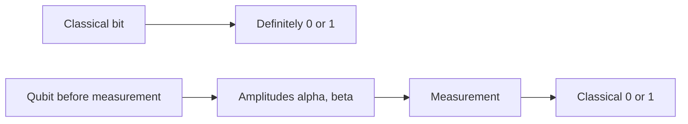

# Bits and qubits

## Bit versus qubit

A **classical bit** is definitely 0 or 1. A **qubit** is described by amplitudes until you measure it.

Rather than picturing a qubit as simply "both 0 and 1 at the same time", think of it as a state described by amplitudes. Those amplitudes carry probability and phase information, and measurement produces one classical outcome.

:::visual
id: bit-vs-qubit
:::

## Measurement

When you measure, you always get a classical 0 or 1. The probabilities are given by |α|² and |β|².

**What this means:** Before measurement, the qubit is described by amplitudes. Measurement produces a classical result.

:::disclosure
id: optional-notation
label: Show the notation
level: intermediate
:::
