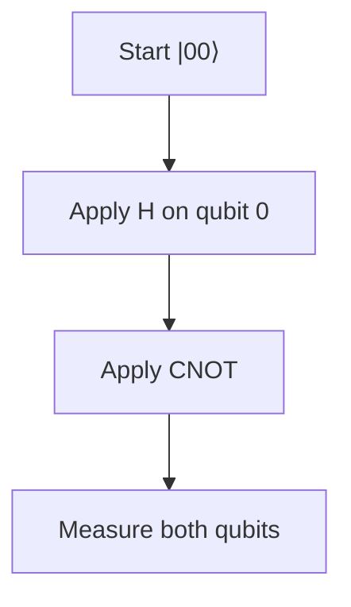

# Entanglement

## Bell state circuit

A **Bell state** prepares two qubits so their joint outcomes are correlated.

:::visual
id: bell-correlation
:::

## Individual uncertainty

Each qubit alone looks **individually uncertain** — you might see 0 or 1 with equal probability.

## Pairwise correlation

The two results are **pairwise correlated**. In the Bell state you will see **00 and 11 outcomes**, not 01 or 10.

## No faster-than-light communication

Entanglement does **not** allow faster-than-light communication. You cannot control which correlated outcome appears.

When you are ready for hands-on practice, see the public EXP-001 quantum fundamentals experiment in this repository.

:::disclosure
id: optional-notation
label: Show the notation
level: intermediate
:::
