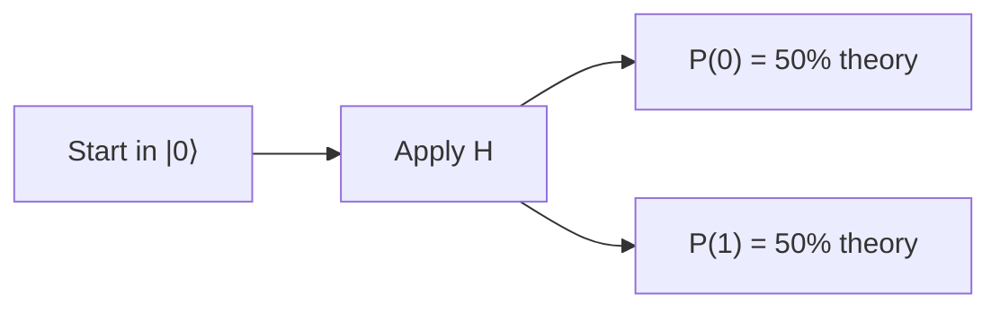

# Hadamard and interference

The **Hadamard** gate changes a definite starting state into a quantum state with equal measurement probabilities.

## Hadamard probability split

:::visual
id: hadamard-probability-split
:::

Equal probabilities do not reveal all of the phase information in the state. Compare **Theory** with **Samples** when you run the circuit.

:::interaction
id: quantum-prediction
experiment: hadamard
shots_default: 4096
:::

## Why a second Hadamard matters

Amplitudes can reinforce and cancel. The second Hadamard is not merely another random split.

:::visual
id: z-phase-reveal
:::

## Double-H interference

:::visual
id: double-h-interference
:::

:::disclosure
id: optional-maths
label: Why phase matters
level: intermediate
body: Probabilities use squared amplitude magnitudes, so two states can look identical when measured immediately yet interfere differently after another gate. Relative phase controls whether amplitudes reinforce or cancel.
:::

Static export note: the prediction interaction is available in the public Learning Console app; exported HTML explains the activity without claiming live widgets.
