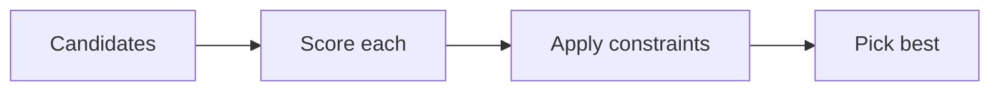

# What is an optimisation problem?

## Candidate solutions

An optimisation problem starts with **candidate solutions** — the choices you could make.

## Objective or score

Each candidate gets an **objective or score**. Higher or lower might be better depending on the problem.

## Constraints

**Constraints** rule out candidates that are not allowed. Only feasible candidates compete for the best score.

## Best solution

The **best solution** is the feasible candidate with the optimal score. On small problems we can try every option (brute force / exact search).

## Everyday example

Choosing a route with the shortest travel time: routes are candidates, time is the objective, road closures are constraints.

## Bridge toward Max-Cut

Later you will see **Max-Cut** — split graph nodes into two groups to maximise edges crossing between groups. That is an optimisation problem, not a quantum claim at this stage.

No quantum hardware is needed to understand the setup at this stage.

:::disclosure
id: optional-maths
label: Why exact-first matters
level: intermediate
body: For two binary choices, list `00`, `01`, `10` and `11`, score each, discard any invalid choices and select the best score. Complete enumeration is practical here and gives a reference for judging a heuristic.
:::
